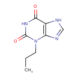
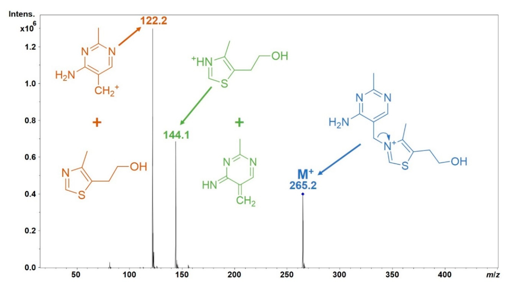

<style type="text/css">

slides > slide:not(.nobackground):after {
  content: '';
}

slides > slide {
    -webkit-transition:none !important;transition:none !important;
}

.build > * {
  -webkit-transition: opacity 0.1s ease-in-out;
  -webkit-transition-delay: 0.1s;
  -moz-transition: opacity 0.1s ease-in-out 0.1s;
  -o-transition: opacity 0.1s ease-in-out 0.1s;
  transition: opacity 0.1s ease-in-out 0.1s;
}

.reveal .slides section .slideContent{
    font-size: 10pt;
}

</style>

<!--
Export to pdf:
webshot function from webshot package.
Might have to change stuff in the style sheet to make it working.
library(webshot)
install_phantomjs()
fn <- paste0("file://", normalizePath("metabolomics.html"))
rmdshot("metabolomics.Rmd", "metabolomics.pdf")
-->

## Content

- Introduction to metabolomics
- Types of metabolomics data
- Handling and processing metabolomics data 
- Annotation of metabolomics data

## Metabolite? Metabolism?

- [Glycolysis](https://en.wikipedia.org/wiki/Glycolysis)

```{r out.width = "700px", echo = FALSE}
knitr::include_graphics("images/Glycolysis_01.png")
```

<div style="font-size: 80%;">
- Key metabolic pathway common to all cells.
- Creates energy by converting glucose to pyruvate.
<div>

## Metabolite? Metabolism?

- [Glycolysis](https://en.wikipedia.org/wiki/Glycolysis)

```{r out.width = "700px", echo = FALSE}

```

## Metabolite? Metabolism?

- [Glycolysis](https://en.wikipedia.org/wiki/Glycolysis)

```{r out.width = "700px", echo = FALSE}

```

## Metabolite? Metabolism?

- [Glycolysis](https://en.wikipedia.org/wiki/Glycolysis)

```{r out.width = "700px", echo = FALSE}

```

## Metabolite? Metabolism?

- [Glycolysis](https://en.wikipedia.org/wiki/Glycolysis)

```{r out.width = "700px", echo = FALSE}

```

## Metabolite? Metabolism?

- [Glycolysis](https://en.wikipedia.org/wiki/Glycolysis)

```{r out.width = "700px", echo = FALSE}

```

## Metabolite? Metabolism?

- [Glycolysis](https://en.wikipedia.org/wiki/Glycolysis)

```{r out.width = "700px", echo = FALSE}
knitr::include_graphics("images/Glycolysis_12.png")
```

- Metabolites: intermediates and products of cellular processes.

## Metabolomics? {.build}

- Large-scale study of small molecules (metabolites) in a system (cell, tissue,
  organism).

<div>
- Comparison of the different -omes:
</div>
<div>
  - **Genome**: what can happen.
</div>
<div>
  - **Transcriptome**: what appears to be happening.
</div>
<div>
  - **Proteome**: what makes it happen.
</div>
<div>
  - **Metabolome**: what actually happened.
</div>
<div>
- Metabolome influenced by genetic **and** environmental factors.
</div>

## Influence from genetic factors {.build}

- mGWAS result:

<div>

</div>

<div style="position:absolute; left:55%; top:20%;">


</div>

<div style="postition:absolute; left: 40px; top:85%;">
- SLC22A5: carnitine transporter.
</div>

## Environmental influence {.build}

<div>

<div style="position:absolute; left: 40px; top:90%; font-size:50%; color:#808080;">
Verri et al. MDPI Metabolites 2022.
</div>
</div>


## Metabolome is dynamic

- Important for experimental planning.

## Where can we measure metabolites? {.build}

<div>
- Blood (serum):
  - insights into general physiological state.
  - venous blood/capillary (arterial) blood.
</div>
<div>
- Cell extracts:
  - insights in mitochondrial metabolism.
</div>
<div>
- Cell supernatant:
  - what did cells *consume*?
</div>
<div>
- Other: urine, food, soil, water (environmental sciences) ...
</div>

## How can we measure metabolites? {.build}

<div>
- Nuclear Magnetic Resonance (NMR) - not covered here.
- Mass spectrometry (MS)-based metabolomics.
</div>

<div>
- Metabolites small enough to be directly measured by MS.
- Most metabolites uncharged - need to create ions first.
</div>

<div>
- Targeted/untargeted metabolomics:
</div>
<div>
  - **targeted**: quantitative measurement of selected metabolites.
</div>
<div>
  - **untargeted**: semi-quantitative measurement of all metabolites (detectable
    with the setup) in a sample.
</div>


## Mass Spectrometry (MS)

<div style="position:absolute; top:28%; left:7%; width:400px">
```{r out.width = "400px", echo = FALSE}
knitr::include_graphics("images/MS_ionization_mod.png")
```
</div>

## Mass Spectrometry (MS)

<div style="position:absolute; top:28%; left:7%; width:400px">
```{r out.width = "400px", echo = FALSE}
knitr::include_graphics("images/MS_ionization_mod.png")
```
</div>
<div style="position:absolute; top:20%; left:53%; width:300px">
```{r out.width = "300px", echo = FALSE}
knitr::include_graphics("images/Spectrum1_mod.png")
```
</div>

<div style="position:absolute; top:65%;left:7%">
> - **Problem:** unable to distinguish between metabolites with the same/similar 
    mass-to-charge ratio (m/z).
> - **Solution:** additional separation of metabolites prior to MS.
</div>


## Liquid chromatography {.build}

<div>
- Sample is dissolved in a fluid (mobile phase).

<div style="position:absolute; top:75%;left:25%">
```{r out.width = "500px", echo = FALSE}
knitr::include_graphics("images/LC_01.png")
```
</div>
</div>

## Liquid chromatography

- Sample is dissolved in a fluid (mobile phase).

- Mobile phase carries analytes through column (stationary phase).

<div style="position:absolute; top:75%;left:25%">
```{r out.width = "500px", echo = FALSE}

```
</div>


## Liquid chromatography

- Sample is dissolved in a fluid (mobile phase).

- Mobile phase carries analytes through column (stationary phase).

- Separation based on affinity for the column's stationary phase.

<div style="position:absolute; top:75%;left:25%">
```{r out.width = "500px", echo = FALSE}

```
</div>


## Liquid chromatography

- Sample is dissolved in a fluid (mobile phase).

- Mobile phase carries analytes through column (stationary phase).

- Separation based on affinity for the column's stationary phase.

- Commonly used:
  [RPLC](https://en.wikipedia.org/wiki/Reversed-phase_chromatography) (Reversed
  Phase LC).
  [HILIC](https://en.wikipedia.org/wiki/Hydrophilic_interaction_chromatography)
  (hyrophilic liquid interaction chromatography)

<div style="position:absolute; top:75%;left:25%">
```{r out.width = "500px", echo = FALSE}

```
</div>


<!-- Now comes the incremental LC-MS description -->
## | **Liquid Chromatography Mass Spectrometry (LC-MS)** {.notransition}

```{r out.width = "700px", echo = FALSE}
knitr::include_graphics("images/MS_Spectrum1.png")
```

## | **Liquid Chromatography Mass Spectrometry (LC-MS)** {.notransition}

```{r out.width = "700px", echo = FALSE}
knitr::include_graphics("images/LCMS_Spectrum1.png")
```

<div style="position:absolute; left:50%; top:55%">
We gain an additional dimension:

- retention time.
</div>

## | **Liquid Chromatography Mass Spectrometry (LC-MS)** {.notransition}

```{r out.width = "700px", echo = FALSE}
knitr::include_graphics("images/LCMS_Spectrum2.png")
```

<div style="position:absolute; left:50%; top:55%">
We gain an additional dimension:

- retention time.
</div>

## | **Liquid Chromatography Mass Spectrometry (LC-MS)** {.notransition}

```{r out.width = "700px", echo = FALSE}

```

<div style="position:absolute; left:50%; top:55%">
We gain an additional dimension:

- retention time.
</div>

## | **Liquid Chromatography Mass Spectrometry (LC-MS)** {.notransition}

```{r out.width = "700px", echo = FALSE}
knitr::include_graphics("images/LCMS_Spectrum4.png")
```

<div style="position:absolute; left:50%; top:55%">
We gain an additional dimension:

- retention time.
</div>

## | **Liquid Chromatography Mass Spectrometry (LC-MS)** {.notransition}

```{r out.width = "700px", echo = FALSE}
knitr::include_graphics("images/LCMS_Spectrum5.png")
```

<div style="position:absolute; left:50%; top:55%">
We gain an additional dimension:

- retention time.
</div>

## | **Liquid Chromatography Mass Spectrometry (LC-MS)** {.notransition}

```{r out.width = "700px", echo = FALSE}
knitr::include_graphics("images/LCMS_Spectrum6.png")
```

<div style="position:absolute; left:50%; top:55%">
We gain an additional dimension:

- retention time.
</div>

## | **Liquid Chromatography Mass Spectrometry (LC-MS)** {.notransition}

```{r out.width = "700px", echo = FALSE}
knitr::include_graphics("images/LCMS_Spectrum6.png")
```

<div style="position:absolute; left:50%; top:55%">
We gain an additional dimension:

- retention time.
</div>

<div style="position:absolute; left:50%; top:70%">
- LC-MS: analyze data along retention time.
</div>

## | **Liquid Chromatography Mass Spectrometry (LC-MS)** {.notransition}

<div>

</div>


## Mass Spectrometry Data {.build}

```{r, echo = FALSE, message = FALSE}
## Run preprocessing on one file
library(Spectra)
library(xcms)
fl <- system.file("mzML", "HighIS_Mix07_CE20_POS.mzML",
                  package = "MetaboAnnotationTutorials")
std_data <- readMSData(fl, mode = "onDisk")
cwp <- CentWaveParam(snthresh = 5, prefilter = c(3, 300), ppm = 40,
                     peakwidth = c(2, 8), integrate = 2)
std_data <- findChromPeaks(std_data, param = cwp)
std_data <- refineChromPeaks(std_data, MergeNeighboringPeaksParam(expandRt = 3))
```

<div>
- mzML files.
</div>

<div style="position:absolute; left:50px; top:270px;">

</div>

<div>
<div style="position:absolute; left:100px; top:183px;">

</div>
<div style="position:absolute; left:25%; top:220px;">
`ms <- readMSData(fl, mode = "onDisk")`
</div>
</div>

<div>
<div style="position:absolute; left:100px; top:357px;">

</div>
<div style="position:absolute; left:25%; top:400px;">
`sps <- Spectra(fl, backend = MsBackendMzR())`
</div>
</div>


## LC-MS data analysis {.build}

<div>
- Untargeted metabolomics (label-free proteomics).

<div style="position:absolute; left:50px; top:270px;">

</div>

<div style="position:absolute; left:100px; top:183px;">

</div>
</div>
<div>
<div style="position:absolute; left:200px; top:183px;">

</div>
<div style="position:absolute; left:35%; top:220px;">
- LC-MS preprocessing:
</div>
</div>

## LC-MS data analysis {.notransition}

- Untargeted metabolomics (label-free proteomics).

<div style="position:absolute; left:50px; top:270px;">

</div>

<div style="position:absolute; left:100px; top:183px;">

</div>
<div style="position:absolute; left:200px; top:183px;">

</div>
<div style="position:absolute; left:35%; top:220px;">
- LC-MS preprocessing:
  - chromatographic peak detection
</div>

<div style="position:absolute; left:20%; top:55%">

</div>

## LC-MS data analysis {.notransition}

- Untargeted metabolomics (label-free proteomics).

<div style="position:absolute; left:50px; top:270px;">

</div>

<div style="position:absolute; left:100px; top:183px;">

</div>
<div style="position:absolute; left:200px; top:183px;">

</div>
<div style="position:absolute; left:35%; top:220px;">
- LC-MS preprocessing:
  - chromatographic peak detection
  - alignment
</div>

<div style="position:absolute; left:20%; top:55%">

</div>

## LC-MS data analysis {.notransition}

<div>
- Untargeted metabolomics (label-free proteomics).

<div style="position:absolute; left:50px; top:270px;">

</div>

<div style="position:absolute; left:100px; top:183px;">

</div>
<div style="position:absolute; left:200px; top:183px;">

</div>
<div style="position:absolute; left:35%; top:220px;">
- LC-MS preprocessing:
  - chromatographic peak detection
  - alignment
  - correspondence
</div>

<div style="position:absolute; left:20%; top:55%">

</div>

## LC-MS data analysis {.notransition}

<div>
- Untargeted metabolomics (label-free proteomics).

<div style="position:absolute; left:50px; top:270px;">

</div>

<div style="position:absolute; left:100px; top:183px;">

</div>
<div style="position:absolute; left:200px; top:183px;">

</div>
<div style="position:absolute; left:35%; top:220px;">
- LC-MS preprocessing:
  - chromatographic peak detection
  - alignment
  - correspondence
</div>

<div style="position:absolute; left:15%; top:60%; font-size:50%;">
```{r, echo = FALSE, message = FALSE}
npks <- nrow(chromPeaks(std_data))
fts <- DataFrame(
    mz = chromPeaks(std_data)[, "mz"],
    rt = chromPeaks(std_data)[, "rt"],
    sample_1 = chromPeaks(std_data)[, "into"],
    sample_2 = abs(chromPeaks(std_data)[, "into"] + rnorm(npks, 70, 70)),
    sample_3 = abs(chromPeaks(std_data)[, "into"] + rnorm(npks, 40, 70)),
    sample_4 = abs(chromPeaks(std_data)[, "into"] + rnorm(npks, 90, 70)))
rownames(fts) <- sub("CP", "FT", rownames(fts))
fts
```
</div>

## But wait - what are we measuring?


<div style="position:absolute; left:15%; top:60%; font-size:50%;">
```{r, echo = FALSE, message = FALSE}
fts
```
</div>


## One step back: ionization {.build}

```{r, echo = FALSE, results = "asis"}
library(MetaboCoreUtils)
library(pander)
cmps <- data.frame(name = c("Caffeine", "Enprofylline"),
                   formula = c("C8H10N4O2", "C8H10N4O2"))
cmps$exactmass <- calculateMass(cmps$formula)

cmps <- cbind(cmps, mass2mz(cmps$exactmass, adduct = c("[M+H]+", "[M+Na]+")))

pandoc.table(cmps[1, 1:3], style = "rmarkdown")
```

<div style="position:absolute; left:5%; top:40%">
- Molecule not charged. Can not be detected with MS.
</div>

## One step back: ionization {.notransition}

```{r, echo = FALSE, results = "asis"}
pandoc.table(cmps[1, 1:4], style = "rmarkdown")
```

<div style="position:absolute; left:5%; top:40%">
- Molecule not charged. Can not be detected with MS.
- Electro spray ionization: create ions
</div>

## One step back: ionization {.notransition}

```{r, echo = FALSE, results = "asis"}
pandoc.table(cmps[1, ], style = "rmarkdown")
```

<div style="position:absolute; left:5%; top:40%">
- Molecule not charged. Can not be detected with MS.
- Electro spray ionization: create ions, potentially multiple.
</div>

## One step back: ionization {.notransition}

```{r, echo = FALSE, results = "asis"}
pandoc.table(cmps[1, ], style = "rmarkdown")
```

<div style="position:absolute; left:5%; top:40%">
- Molecule not charged. Can not be detected with MS.
- Electro spray ionization: create ions, potentially multiple.
- Match measured m/z against these reference values.
</div>

<div style="position:absolute; left:50px; top:450px;">

</div>
<div style="position:absolute; left:25%; top:475px;">
```{r, eval = FALSE}
mtch <- matchValues(query, target,
                    Mass2MzParam(c("[M+H]+", "[M+Na]+")))
```
</div>

## A little additional complication {.build}

<div>
```{r, echo = FALSE, results = "asis"}
pandoc.table(cmps, style = "rmarkdown")
```
<div style="position:absolute; left:5%; top:50%">
- Compounds can have same formula - how to distinguish?
</div>
</div>

## A little additional complication {.notransition}

```{r, echo = FALSE, results = "asis"}
pandoc.table(cmps, style = "rmarkdown")
```
<div style="position:absolute; left:5%; top:50%">
- Compounds can have same formula - how to distinguish?
- They differ by their structure.
</div>

<div style="position:absolute; left:150px; top:500px">

</div>

<div style="position:absolute; left:500px; top:500px">

</div>

## Using m/z **and** retention time {.build}

- Structure can have an influence on the polarity of compounds and thus they
  will separate in the LC: -> different retention time.
- Annotation using m/z and retention time:

<div>
<div style="position:absolute; left:50px; top:400px;">

</div>
<div style="position:absolute; left:25%; top:425px;">
```{r, eval = FALSE}
mtch <- matchValues(query, target,
                    Mass2MzRtParam(c("[M+H]+", "[M+Na]+")))
```
</div>
</div>

- Requires that we do have **reference** retention times available.

## Using MS2 spectra {.build}

- We can *fragment* ions to get some information on their structure:

<div>

</div>

## Using MS2 spectra {.build}

- If we have MS2 spectra associated to features, we can match them against
  reference spectra.

```{r, echo = FALSE, message = FALSE}
library(MsBackendMgf)
sps <- Spectra("data/caffeine.mgf", source = MsBackendMgf())
plotSpectraMirror(sps[1], sps[2], ppm = 70)
```

## Using MS2 spectra {.notransition}

- If we have MS2 spectra associated to features, we can match them against
  reference spectra.

<div>
<div style="position:absolute; left:50px; top:320px;">

</div>
<div style="position:absolute; left:25%; top:345px;">
```{r, eval = FALSE}
simmat <- compareSpectra(a, b)
```
</div>
</div>

<div>
<div style="position:absolute; left:50px; top:470px;">

</div>
<div style="position:absolute; left:25%; top:505px;">
```{r, eval = FALSE}
mtch <- matchSpectra(query, target,
                     CompareSpectraParam())
```
</div>
</div>


## Using MS2 spectra {.notransition}

- If we have MS2 spectra associated to features, we can match them against
  reference spectra.

<div>
<div style="position:absolute; left:50px; top:320px;">

</div>
<div style="position:absolute; left:25%; top:355px;">
```{r, eval = FALSE}
simmat <- compareSpectra(a, b)
```
</div>
</div>

<div>
<div style="position:absolute; left:50px; top:470px;">

</div>
<div style="position:absolute; left:25%; top:490px;">
```{r, eval = FALSE}
mtch <- matchSpectra(query, target,
                     CompareSpectraParam())
```
</div>
</div>

- Problem: availability of reference spectra.


## Workshops

- Preprocessing: metabolomics2018.
- `SpectraTutorials`
- `MetaboAnnotationTutorials`

